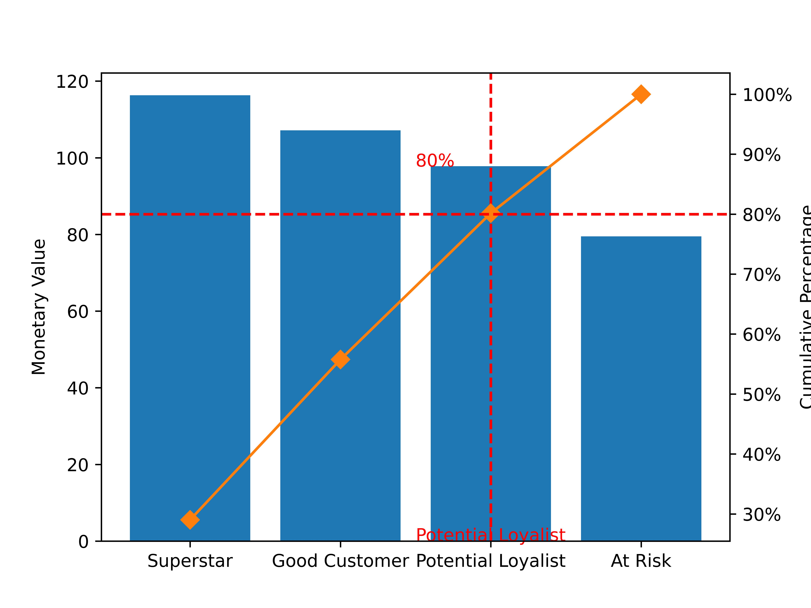

# greenmart_rfm_repo
An analysis of customer segmentation for GreenMart using RFM model.

**Problem Statement and Use Case for RFM Study: "GreenMart"**

**Problem Statement**:
GreenMart, a mid-sized retail store, has been experiencing fluctuating sales and inconsistent customer retention rates. Despite various marketing efforts, the store struggles to identify and target its most valuable customers effectively. The management seeks a data-driven approach to segment customers based on their purchasing behavior to enhance marketing strategies, improve customer retention, and boost overall sales.

**Use Case**:

**Objective**: To segment GreenMart's customers using Recency, Frequency, and Monetary (RFM) analysis to tailor marketing strategies and improve customer retention.

**Process Description**:

1. **Data Collection**:
   - Gather transaction data from GreenMart's database, including customer ID, transaction date, and transaction amount.

2. **Data Preparation**:
   - Import necessary libraries: `pandas`, `datetime`, `numpy` etc.
   - Load the dataset into a DataFrame.

   `import pandas as pd`
   
   `import datetime as dt`
   
   `import numpy as np`

   `data = pd.read_csv('greenmart_transactions.csv')`

  

3. **Calculating RFM Metrics**:
   - **Recency**: Calculate the number of days since the last purchase.
   - **Frequency**: Count the number of transactions per customer.
   - **Monetary**: Sum the total amount spent by each customer.

4. **Merging RFM Metrics**:
   - Combine the recency, frequency, and monetary metrics into a single DataFrame.
  

  

5. **RFM Scoring**:
   - Assign scores to each RFM metric based on quantiles.

    `df.loc[:,'R'] = pd.qcut(df['Recency'], q=quartiles, labels=labels_desc).astype('category')`

    `df.loc[:,'F'] = pd.qcut(df['Frequency'], q=quartiles, labels=labels_asc).astype('category')`

    `df.loc[:,'M'] = pd.qcut(df['Monetary'], q=quartiles, labels=labels_asc).astype('category')`

  

6. **Customer Segmentation:**
    - Group customers into segments based on their RFM scores.
    The segments include:
        - Superstar: High RFM scores, most valuable customers.
        - Potential Loyalists: High frequency, but lower recency and moderate monetary value.
        - Good Customers: High monetary value, but lower frequency or recency than Superstars
        - At Risk: Low RFM scores, inactive customers.

  

7. **Vizualizations:**
    - Made several charts to depict pareto charts, radar charts, heatmaps etc.

  

**VERSION**
---
python: 3.12.4
numpy: 1.26.4
pandas: 2.2.2
matplotlib: 3.9.1.post1
requests: 2.32.2
seaborn: 0.13.2